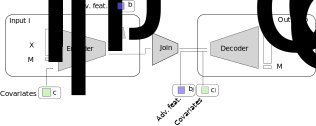

========
scMaui
========

|Tests badge|

.. |Tests badge| image:: https://github.com/BIMSBbioinfo/scmaui/actions/workflows/python-tests-and-formatting.yml/badge.svg
   :target: https://github.com/BIMSBbioinfo/scmaui/actions/workflows/python-tests-and-formatting.yml

scMaui is python package that implements a
variational auto-encoder for multi-omics data integration.
The model is capable of handling variable numbers input and output modalities
as well as missing modalities.
The model also features a range of log-likelihood implementations for determining the reconstruction
loss, including the negative binomial or the negative multinomial model.

The package is freely available under a GNU Lesser General Public License v3 or later (LGPLv3+)

Installation
============

::

    pip scmaui

Usage
=====

.. code-block:: python

   import pkg_resources
   from scmaui.data import load_data, SCDataset
   from scmaui.utils import get_model_params
   from scmaui.ensembles import EnsembleVAE

   # get some toy data
   toy_data_path = pkg_resources.resource_filename('scmaui', 'resources/gtx.h5ad')

   adatas = load_data([toy_data_path], names=['gtx'])
   dataset = SCDataset(adatas, losses=['negbinom'])

   # create an scMaui model
   params = get_model_params(dataset)
   ensemble = EnsembleVAE(params=params)

   # fit the model
   ensemble.fit(dataset, epochs=10)
   ensemble.summary()

   # obtain latent features
   latents, _ = ensemble.encode(dataset)

   # obtain an imputation
   imputed = ensemble.impute(dataset)

   # obtain input feature attributions
   selected_cells = latents.index.tolist()[:5] # select first 5 cells
   explanation = ensemble.explain(dataset, cellids=selected_cells)

Command-line usage
==================

scMaui offers a command line interface for model fitting.
The results are stored in an output directory (-output).

::

   scmaui -data adata.h5ad \
         -datanames gtx \
         -output <outputdir> \
         -epochs 200 \
         -ensemble_size 10 \
         -nlatent 15 \
         -adversarial label1 label2 \
         -conditional covariate1 covariate2 \
         -losses negmul negbinom
 
Additional information on available hyper-parameters are available through

::

  scmaui -h

